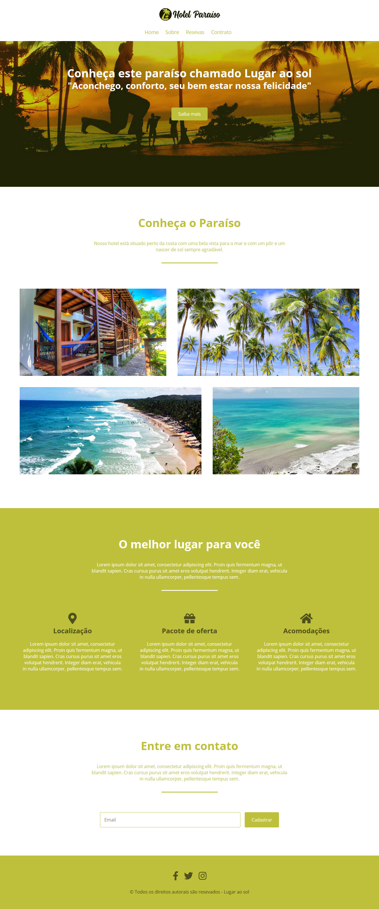

# Cursos de FlexBox

**Desenvolvimento de aplicações web responsivas**

Cabeçalho do projeto e apresentação da pagina principal.

Layout completo do projeto.

### Desenvolvimento ###

A construção dessa página teve como principal objetivo o design responsivo,
para isso foi utilizado ajusatados com flexbox. Essa propriedade consiste em transformar os 
elementos estáticos em elementos flexíveis, dessa dessa maneira substitui a técnica de de Float
onde os desenvolveres flota os elementos para que se adeque a telas responsivas. Uma das vantagens dessa
propriedade é o benefício de redução de custos no desenvolvimento da web page pois, diminue o custo de manutenção e o tempo de desenvolvimento.